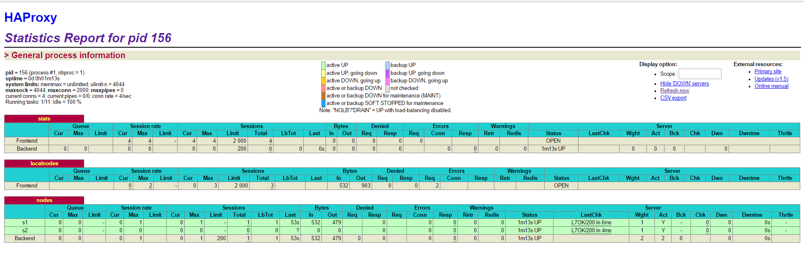
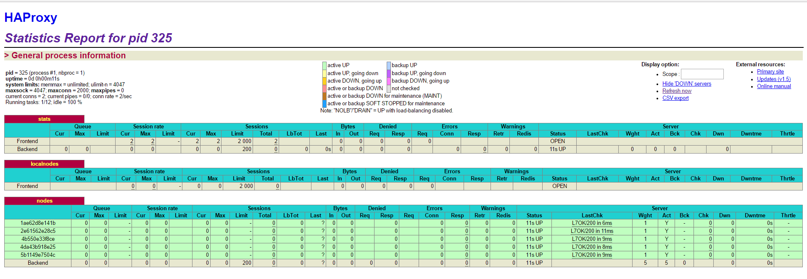

## Lab 04 - Docker  
Author: Rodrigue Tchuensu && Pascal Sekley 
Date: 2016-02-26


#### Pedagogical objectives

* Build your own Docker images

* Become familiar with lightweight process supervision for Docker

* Understand core concepts for dynamic scaling of an application in production

* Put into practice decentralized management of web server instances

##Task 0: Identify issues and install the tools  

1. [*M1*] Yes we can use this solution in a production environment but it has some limitations. This solution is not dynamycally scalable.  

2. [*M2*] To add new webapp containers to the infrastructure, you first need to instanciate the webapp container, then you get it's IP address and add it to the HAProxy configuration file, also you will need to add the following line to the script in ha  `sed -i 's/<s3>/$S3_PORT_3000_TCP_ADDR/g' /usr/local/etc/haproxy/haproxy.cfg` Finally you need to restart the HAProxy container for it to take into account the changes that have been done to it's configuration file, not forgetting to link the haproxy container to the new webapp container.

3. [*M3*] From the discussion we had in class with our teacher, we have to make things to occur automatically. We could provide a script that will be run automatically to edit the configuration file in HAProxy container, we use tools that will detect the presence of a new server or the shutdown (down-state) of an existing server and be able to notify the loadbalancer.  

4. [*M4*]  By using an agent like serf, that will make it possible for the servers and the loadbalancer to be able to discover each other as long as they belong to the same infrastructure and with the help of a script that is ran automaticaly in case of any accountable change, the necessary information will be inscribe in the configuration file for any upcoming node.

5. [*M5*]It is not possible to run more than one process in a container with our current solution, because the app was develope to suite the docker tenet i.e one process per container philosophy. We could use a process supervisor to achieve the goal.

6. [*M6*]


##Task 1: Add a process supervisor to run several processes

1. Take a screenshot of the stats page of HAProxy at http://192.168.42.42:1936. You should see your backend nodes. It should be really similar to the screenshot of the previous task.
**Answer:**  

2. Describe your difficulties for this task and your understanding of what is happening during this task. Explain in your own words why are we installing a process supervisor. Do not hesitate to do more research and to find more articles on that topic to illustrate the problem.
Answer:   In this task there is a principal issue that arises from the philosophy the developpers of docker containers used to develope the later. Their main aim was to enable one and only one process to run per container. More to this in their way of seeing things a process is considered a valid process for a docker container only if it is running as a foreground container. That is a container is launched and stays running if and only if it habors a process running as a foreground process that is background processes are not recognise by docker containers on their own and hence this will cause a container to stop. So the difficulty here is to fine a way to keep a docker container running while there is a process running in background mode.
We install a process supervisor to enable us deviate from the classical use of docker containers (one process per container), this supervisor enable us to run more than one process per container and since it is ran as fore ground process, it ensures us that even if the other processes were running in background mode, the container will continu running.   

##Task 2: Add a tool to manage membership in the web server cluster  

1. Provide the docker log output for each of the containers: ha, s1 and s2. You need to create a folder logs in your repository to store the files separately from the lab report. For each lab task create a folder and name it using the task number. No need to create a folder when there are no logs.  
**Answer:**
 [ha logs](../logs/task_2/haLogs_task2.log)  
 [s1 logs](../logs/task_2/s1Logs_task2.log)  
 [s2 logs](../logs/task_2/s2Logs_task2.log) 


2. Give the answer to the question about the existing problem with the current solution.  
**Answer:** In our solution all the nodes join the cluster through the ha node, this does not suite the serf approach, because according to the serf formalism a node should get to the cluster through any other node that is already part of the cluster. It could happen that the ha node is not up this means the other nodes will be able to get to the cluster which is not what we want. ....


3. Give an explanation on how Serf is working. Read the official website to get more details about the GOSSIP protocol used in Serf. Try to find other solutions that can be used to solve similar situations where we need some auto-discovery mechanism.  
**Answer:**  Serf begins by joining an existing cluster or starting a new cluster. new nodes in an existing cluster must be given the address of at least one existing member of the cluster in order to join the clust. Serf uses a gossip protocol to broadcast messages  the cluster. When a node joins the cluster, Serf sends a **_join intent_**, this will attach a Lamport clock time to a join, this will be used in case of a leave. When a node gracefully leaves the cluster, Serf sends a **_leave intent_**, this is used by the serf layer to distinguish between a graceful leave and a failure.   
The gossip protocol is based on SWIM. It enables additional new nodes to join a cluster by going through atleast one node that is already a member of the cluster.   
we could also use any of these tools ZooKeeper, doozerd and etcd to reach to a solution.


##Task 3: React to membership changes    
1. Provide the docker log output for each of the containers: ha, s1 and s2. Put your logs in the logs directory you created in the previous task.  
**Answer:**  
[ha logs](../logs/task_3/haLogs_task3.log)     
[ha logs](../logs/task_3/haLogs_2_task3.log)  
[s1 logs](../logs/task_3/s1Logs_task3.log)    
[s1 logs](../logs/task_3/s2Logs_task3.log)

2. Provide the logs from the ha container gathered directly from the /var/log/serf.log file present in the container. Put the logs in the logs directory in your repo.  
**Answer:**  
[ha logs in container form /var/log/serf.log ](../logs/task_3/haLogsInContainer_task3.log)


##Task 4: Use a template engine to easily generate configuration files    
1. You probably noticed when we added xz-utils, we have to rebuild the whole image which took some time. What can we do to mitigate that?   
**Answer:** We cool make use of a migration tool that will allow us to migrate existing images before upgrading the Docker daemon. By so doing the upgraded Docker daemons will not need to perform the migration in-band and therefore avoids any associated downtime. This tool also provide means to manually migrate existing   

- Take a look at the Docker documentation on image layers. Tell us about the pros and cons to merge as much as possible of the command. In other words, compare:   
 
```
  RUN command 1
  RUN command 2
  RUN command 3
  ```   
  
vs.  

```
RUN command 1 && command 2 && command 3  
```  
**Answer:** Citing the Docker documentation, "The run instruction will execute any commands in new layer on top of the current image and commit the results. The resulting committed image will be used for the next step in the Dockerfile." This means that for each **RUN** instruction that is completed a commit is done. So if we have several **RUN** instructions, we end up having several commits. Whereas when we append several commands in a single **RUN** instruction, a single commit is genarated.
Each of this approaches have their advantages and disadvantages. According to the docker concepts, containers can be created from any point in an image's history. So with respect to the aim of the user it will be advantageous to use the **RUN** command that appends several commands together if we want to use all the outcome of this commands in the container we will run from the image but if our aim is to run individual containers taking into account specific commands it will be advantageous to use several **RUN** instructions, by so doing we can run containers by specifying the state of the image that suits our aim.   
[an article on squashing images](https://github.com/goldmann/docker-squash)   
[another article on squashing images](http://jasonwilder.com/blog/2014/08/19/squashing-docker-images/)

2. Propose a different approach to architecture our images to be able to reuse as much as possible what we have done. Your proposition should also try to avoid as much as possible repetitions between your images.
**Answer:**  

3. Provide the `/tmp/haproxy.cfg` file generated in the `ha` container
   after each step.  Place the output into the `logs` folder like you
   already did for the Docker logs in the previous tasks. Three files
   are expected.   
   [haproxy.cfg logs](../logs/task_4/haproxy_cfg_task4.log)   
   [haproxy.cfg logs](../logs/task_4/haproxy_cfg_2_task4.log)   
   [haproxy.cfg logs](../logs/task_4/haproxy_cfg_3_task4.log)    
   
    In addition, provide a log file containing the output of the 
   `docker ps` console and another file (per container) with
   `docker inspect <container>`. Four files are expected.    
   [docker_ps logs](../logs/task_4/docker_ps_task4.log)     
   [docker_inspect_ha logs](../logs/task_4/docker_inspect_ha_task4.log)     
   [docker_inspect_s1 logs](../logs/task_4/docker_inspect_s1_task4.log)      
   [docker_inspect_s2 logs](../logs/task_4/docker_inspect_s2_task4.log)     
      
   
4. Based on the three output files you have collected, what can you
   say about the way we generate it? What is the problem if any?   
   

##Task 5: Generate a new load balancer configuration when membership changes

1. Provide the file `/usr/local/etc/haproxy/haproxy.cfg` generated in
   the `ha` container after each step. Three files are expected.   
   [haProxy_cfg_task5 logs](../logs/task_5/haProxy_cfg_task5.txt)    
   [haProxy_cfg_s1_launched_task5 logs](../logs/task_5/haproxyCfgS1LaunchedTask5.txt)      
   [dhaProxy_cfg_s2_launched_task5 logs](../logs/task_5/haproxyCfgS2LaunchedTask5.txt)   
   
   In addition, provide a log file containing the output of the 
   `docker ps` console and another file (per container) with
   `docker inspect <container>`. Four files are expected.   
   [docker_Ps_Task5 logs](../logs/task_5/dockerPsTask5.txt)  
   [docker_Inspect_Ha_Task5 logs](../logs/task_5/dockerInspectHaTask5.txt)   
   [docker_Inspect_s1_Task5 logs](../logs/task_5/dockerInspects1Task5.txt)   
   [docker_Inspect_s2_Task5 logs](../logs/task_5/dockerInspects2Task5.txt)   

2. Provide the list of files from the `/nodes` folder inside the `ha` container.
   One file expected with the command output.  
   [lsit of files in /nodes](../logs/task_5/files_list_nodes.txt) 

3. Provide the configuration file after you stopped one container and
   the list of nodes present in the `/nodes` folder. One file expected
   with the command output. Two files are expected.  
   [dhaProxy_cfg_s2_Stopped_task5 logs](../logs/task_5/haproxyCfgS2StoppedTask5.txt)   
   [docker_Inspect_s2_Task5 logs](../logs/task_5/files_list_nodes_s2_stopped.log) 
   
    In addition, provide a log file containing the output of the 
   `docker ps` console. One file expected.
   [docker ps with s2 stopped Task5 logs](../logs/task_5/dockerPs_s2_stopped_Task5.log)    
   

##Task 6: Make the load balancer automatically reload the new configuration   

1. Take a screenshots of the HAProxy stat page showing more than 2 web
   applications running. Additional screenshots are welcome to see a
   sequence of experimentations like shutting down a node and starting
   more nodes.  
   
   
   Also provide the output of `docker ps` in a log file. At least 
   one file is expected. You can provide one output per step of your
   experimentation according to your screenshots.  
   [docker ps with more than 2 webservers logs](../logs/task_6/dockerPsTask6.log)
   
   
2. Give your own feelings about the final solution. Propose
   improvements or ways to do the things differently. If any, provide
   references to your readings for the improvements.